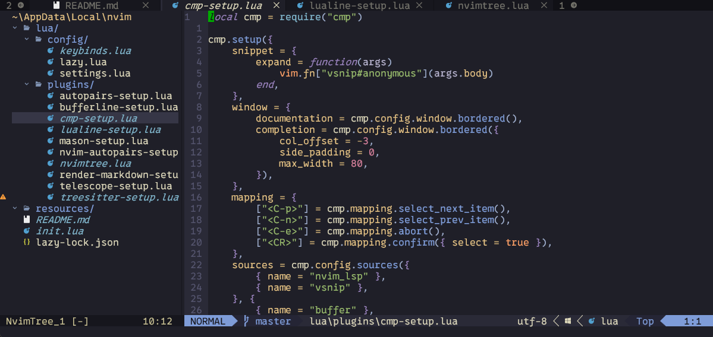

# NeoVim Configuration

This repository contains a comprehensive NeoVim setup with various plugins and custom configurations to enhance your development experience.

## Table of Contents

- [NeoVim Configuration](#neovim-configuration)
  - [Table of Contents](#table-of-contents)
  - [Installation](#installation)
  - [Plugins](#plugins)
  - [Custom Keybindings](#custom-keybindings)
  - [LSP Configuration](#lsp-configuration)
  - [Settings](#settings)
  - [Screenshots](#screenshots)

## Installation

1. Clone this repository to your local machine.
2. Ensure you have NeoVim installed. If not, you can install it using your package manager.
3. Copy the contents of this repository to your NeoVim configuration directory (usually `~/.config/nvim`).
4. Run nvim Lazy.nvim should do the rest.

## Plugins

This setup uses the `lazy.nvim` plugin manager to manage various plugins. Below is a list of the main plugins included:

- **UI Enhancements**
  - `nvim-lualine/lualine.nvim`: Status line.
  - `akinsho/bufferline.nvim`: Buffer line.
  - `nvim-tree/nvim-tree.lua`: File explorer.
  - `nvim-tree/nvim-web-devicons`: File icons.
  - `MeanderingProgrammer/render-markdown.nvim`: Markdown rendering.

- **Themes**
  - `bluz71/vim-moonfly-colors`
  - `rebelot/kanagawa.nvim`
  - `folke/tokyonight.nvim`
  - `bluz71/vim-nightfly-colors`
  - `NLKNguyen/papercolor-theme`

- **LSP and Autocompletion**
  - `neovim/nvim-lspconfig`: LSP configurations.
  - `hrsh7th/nvim-cmp`: Autocompletion plugin.
  - `hrsh7th/cmp-nvim-lsp`: LSP source for nvim-cmp.
  - `hrsh7th/cmp-buffer`: Buffer source for nvim-cmp.
  - `hrsh7th/cmp-path`: Path source for nvim-cmp.
  - `hrsh7th/cmp-cmdline`: Command line source for nvim-cmp.
  - `hrsh7th/cmp-vsnip`: Snippet source for nvim-cmp.
  - `hrsh7th/vim-vsnip`: Snippet plugin.

- **Utilities**
  - `nvim-treesitter/nvim-treesitter`: Treesitter configurations.
  - `williamboman/mason.nvim`: LSP installer.
  - `williamboman/mason-lspconfig.nvim`: Mason LSP configurations.
  - `nvim-telescope/telescope.nvim`: Fuzzy finder.
  - `nvim-lua/plenary.nvim`: Utility functions.
  - `sindrets/diffview.nvim`: Git diff view.
  - `windwp/nvim-autopairs`: Autopairs.
  - `tpope/vim-fugitive`: Git integration.
  - `numToStr/Comment.nvim`: Commenting utility.
  - `github/copilot.vim`: GitHub Copilot integration.

## Custom Keybindings

| Keybinding          | Mode   | Action                                      |
|---------------------|--------|---------------------------------------------|
| `<Esc>`             | `t`    | Exit to normal mode                         |
| `<leader>b`         | `n`    | Next Buffer                                 |
| `<leader>t`         | `n`    | New Tab                                     |
| `<leader>q`        | `n`    | Close Tab                                   |
| `<leader>dv`        | `n`    | Open Diffview                               |
| `<leader>fh`        | `n`    | View file history in Diffview               |
| `<leader>n`         | `n`    | Toggle NvimTree                             |
| `<C-h>`             | `n`    | Move to the left pane                       |
| `<C-j>`             | `n`    | Move to the pane below                      |
| `<C-k>`             | `n`    | Move to the pane above                      |
| `<C-l>`             | `n`    | Move to the right pane                      |
| `<leader>do`        | `n`    | Open diagnostic float                       |
| `<leader>dp`        | `n`    | Go to the previous diagnostic               |
| `<leader>dn`        | `n`    | Go to the next diagnostic                   |
| `<leader>dl`        | `n`    | List diagnostics using Telescope            |
| `<leader>ff`        | `n`    | Telescope find files                        |
| `<leader>f`         | `n`    | Telescope live grep                         |
| `<leader>fb`        | `n`    | Telescope current buffer fuzzy find         |
| `<leader>fc`        | `n`    | Telescope git commits                       |
| `<leader>fg`        | `n`    | Telescope git files                         |
| `<leader>gs`        | `n`    | Telescope grep string                       |
| `<leader>gd`        | `n`    | Telescope LSP definitions                   |
| `<leader>v`             | `n`    | Enter block mode                            |
| `<leader>v`             | `x`    | Enter block mode                            |
| `<leader>cp`        | `n`    | Copy the path of the current file to clipboard |
| `<leader>gd`        | `n`    | Go to the global definition of the word under the cursor |
| `<leader>o`         | `n`    | Open Oil in current file buffer dir              |

## LSP Configuration

The following LSP servers are configured and installed using `mason.nvim` and `nvim-lspconfig`:

- `pylsp` (Python)
- `html` (HTML)
- `gopls` (Go)
- `jsonls` (JSON)
- `yamlls` (YAML)
- `omnisharp` (C#)
- `ts_ls` (TypeScript)
- `markdown_oxide` (Markdown)
- `cssls` (CSS)
- `lua_ls` (Lua)
- `phpactor` (PHP)

## Settings

The settings for NeoVim are configured in [lua/config/settings.lua](lua/config/settings.lua). Key settings include:

- Leader key set to `,`
- Clipboard set to `unnamedplus`
- Line numbers enabled
- UTF-8 encoding
- Auto indentation and smart indentation
- Search settings
- Display settings
- Theme set to `kanagawa-wave`

## Screenshots

