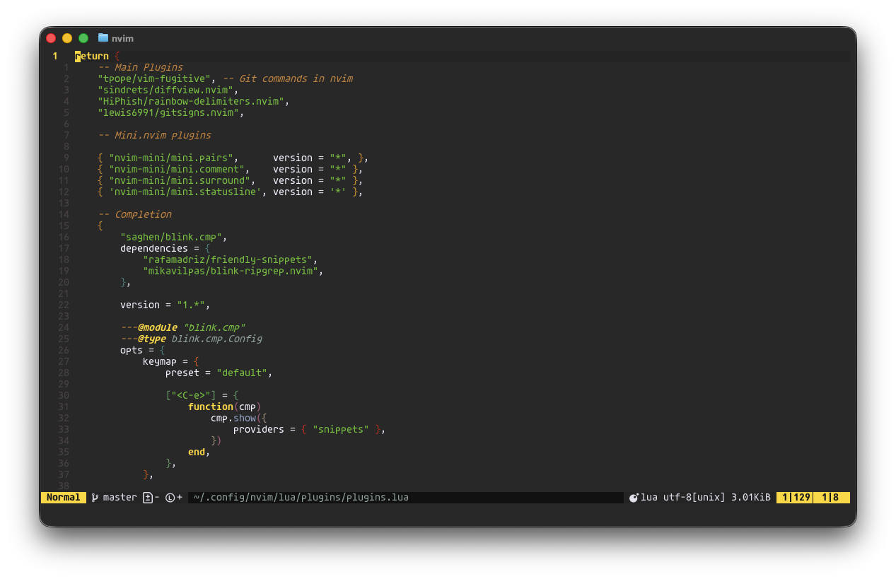

# NeoVim Configuration

This repository contains my personal NeoVim setup, built around `lazy.nvim` and tuned for fast file navigation, LSP-based editing, and git workflows.

> This config is tailored to my workflow, so some defaults and keymaps may not match yours exactly.

## Installation

1. Clone this repository to your local machine.
2. Make sure Neovim and Git are installed.
3. Copy the repository contents into your Neovim config directory, typically `~/.config/nvim`.
4. Launch Neovim and let `lazy.nvim` install the plugins.
5. Run `:checkhealth` and `:Lazy sync` if needed.

## Main features

- `lazy.nvim` plugin manager
- `gruber-dark` colorscheme
- `mini.nvim` utilities for pairs, comments, surrounds, and statusline
- completion with `blink.cmp`
- LSP setup via `mason.nvim`, `mason-lspconfig.nvim`, and `nvim-lspconfig`
- file browsing with `oil.nvim`
- fuzzy finding with `telescope.nvim`
- git integration with `vim-fugitive`, `diffview.nvim`, and `gitsigns.nvim`

## Plugins in use

### Core utilities

- `tpope/vim-fugitive` — Git commands from inside Neovim
- `sindrets/diffview.nvim` — Git diff and file history views
- `HiPhish/rainbow-delimiters.nvim` — colored bracket pairs
- `lewis6991/gitsigns.nvim` — git markers and inline blame

### Mini.nvim

- `nvim-mini/mini.pairs` — auto-pairs
- `nvim-mini/mini.comment` — comment toggling
- `nvim-mini/mini.surround` — surround operations
- `nvim-mini/mini.statusline` — compact statusline

### Completion and snippets

- `saghen/blink.cmp` — completion engine
- `rafamadriz/friendly-snippets` — snippet library
- `mikavilpas/blink-ripgrep.nvim` — ripgrep-powered completion source

### LSP and tooling

- `mason-org/mason.nvim` — LSP/tool installer
- `mason-org/mason-lspconfig.nvim` — installs and manages LSP servers
- `neovim/nvim-lspconfig` — LSP configs

Installed LSPs currently include:

- `gopls`
- `lua_ls`
- `pylsp`
- `yamlls`
- `jsonls`
- `ts_ls`
- `docker_compose_language_service`
- `roslyn_ls`

### Navigation and file browsing

- `nvim-telescope/telescope.nvim` — file search, grep, diagnostics, and more
- `nvim-lua/plenary.nvim` — dependency for Telescope
- `stevearc/oil.nvim` — file explorer in the style of a buffer-based tree
- `nvim-mini/mini.icons` — icon support for Oil

### Themes

The theme set includes several options, with the active default being `gruber-dark`:

- `projekt0n/github-nvim-theme`
- `tanvirtin/monokai.nvim`
- `ellisonleao/gruvbox.nvim`
- `p00f/alabaster.nvim`
- `Mofiqul/dracula.nvim`
- `olimorris/onedarkpro.nvim`
- `d-bastian/gruber-dark.nvim`

## Editor settings

The config is defined in `lua/config/settings.lua` and includes:

- leader key: `,`
- system clipboard enabled via `unnamedplus`
- line numbers and relative line numbers
- 4-space indentation with tabs expanded to spaces
- smart case-insensitive search
- folding based on indentation
- `cursorline` enabled
- `scrolloff` and `sidescrolloff` set to 8
- splits open below/right by default
- persistent undo enabled
- `termguicolors` enabled
- auto-format on save when an LSP supports formatting
- YAML files use 4-space indentation for consistency

## Keybindings

The main shortcuts are defined in `lua/config/keybinds.lua`.

### General

- `<Esc>` in terminal mode: exit terminal mode
- `<leader>fm`: format current buffer
- `<leader>b`: next buffer
- `<leader>t`: new tab
- `<leader>q`: close tab
- `<leader>tn`: next tab
- `<leader>tp`: previous tab
- `<leader>qo`: open quickfix
- `<leader>qc`: close quickfix

### Window and movement

- `<C-d>` / `<C-u>`: half-page movement with centering
- `<C-h>`, `<C-j>`, `<C-k>`, `<C-l>`: move between windows

### Diagnostics

- `<leader>do`: open diagnostics float
- `<leader>dp`: previous diagnostic
- `<leader>dn`: next diagnostic

### Telescope

- `<leader>fd`: find diagnostics
- `<leader>ff`: find files
- `<leader>fg`: find git files
- `<leader>fw`: find word under cursor
- `<leader>fl`: live grep
- `<leader>fb`: find buffers
- `<leader>gd`: go to definition
- `<leader>gc`: git commits

### Git and file tools

- `<leader>dv`: open Diffview
- `<leader>fh`: file history
- `<leader>df`: current file history
- `<leader>tb`: toggle current line blame
- `<leader>hd`: diff current file
- `<leader>cp`: copy current file path
- `<leader>o`: open Oil

### Editing helpers

- `J` / `K` in visual mode: move selected lines down/up

## LSP configuration

Additional LSP customization lives in `lua/customize/mason-setup.lua`, including:

- Python lint settings for `pylsp` with max line length 120 and ignoring `W391`
- Lua diagnostics tuning for `lua_ls`
- Go formatting with `gofumpt`
- JSON validation and formatting

## Notes

This setup is designed to be clean, practical, and fast for day-to-day editing. If you want to tweak the layout, colors, or keymaps, the relevant files are:

- `lua/config/settings.lua`
- `lua/config/keybinds.lua`
- `lua/plugins/plugins.lua`
- `lua/themes/themes.lua`

